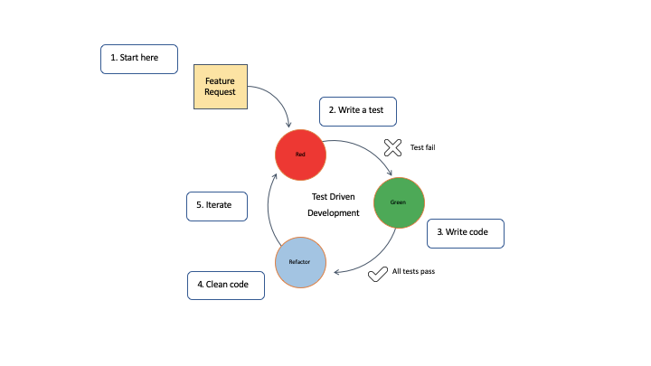

# TDD Task
- Create a new Repo on gihub
- Create a new project in pycharm
- name tdd_test_task
- create a TDD diagram
- create a file to write tests
- create a file to write code
- implement sudo coding
- create a README to document the steps to successfully achieve the task

- create a test to check is the number divisible/remainder 0 if True pass the test if False fail
- create a class and method to write code to pass the test
- create a test case to calculate % and code to pass the test
- create a test to check if the given values are positive
- create a method in the class to pass the test

# Making the calc class and importing unittest and pycharm
- pytest may not be installed so in order to install it enter 'pip install pytest' into the terminal
`import unittest
import pytest`

- step 2 is to import from the 'advanced_calc' (which is currently empty)

`from advanced_calc import AdvancedCalc`
    `calc = AdvancedCalc()`

- step 3 is to create the parameters you wish to test

    `def test_remain(self):
        self.assertEqual(self.calc.remain(10, 2), 0)`
  
    `def test_percent(self):
        self.assertEqual(self.calc.percent(10, 100), 10)`

    `def test_positve(self):
        self.assertEqual(self.calc.positive(2), True)`

- create the 'advanced_calc' file and create the class imported to the calc file (ensure that spelling is accurate)
- run a test in the calc terminal with the command 'python -m pytest'. It should return a message saying that the three tests were run and failed
- next step is to define the functions you wish to test in the advanced_calc file.
`class AdvancedCalc:`
    
    `def remain(self, num1, num2):
        return num1 % num2`
  
    `def percent(self, num1, num2):
        return (num1 / num2) * 100`
  
    `def positive(self, num1):
         return num1 > 0:`
  
- Once the functions have been defined if you run 'python -m pytest' in the calc terminal you should have no failed tests and see all the tests have passed